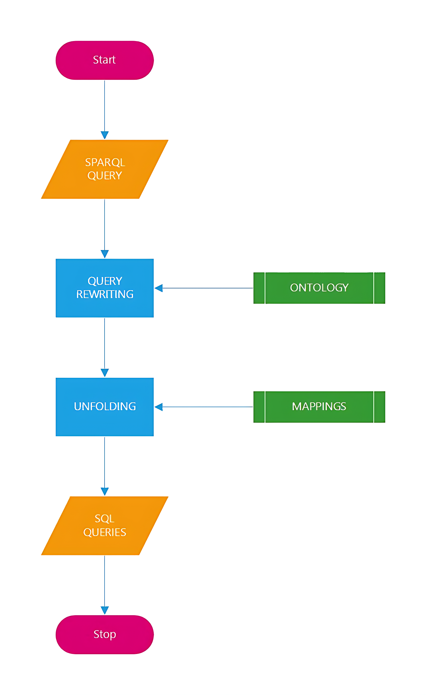
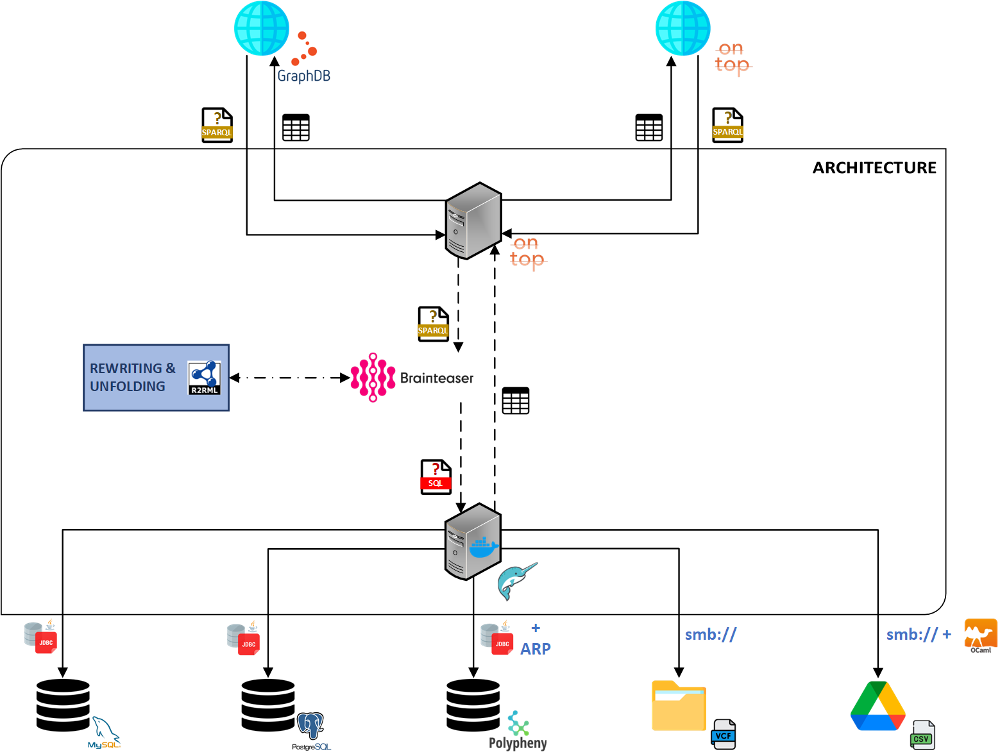
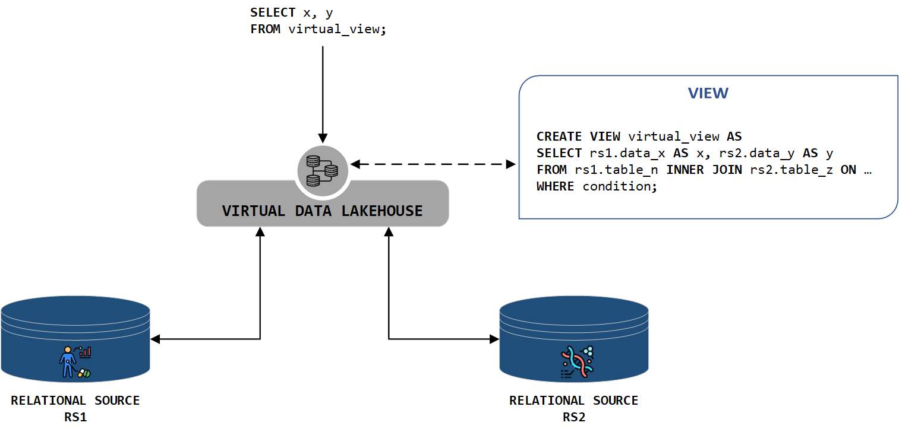
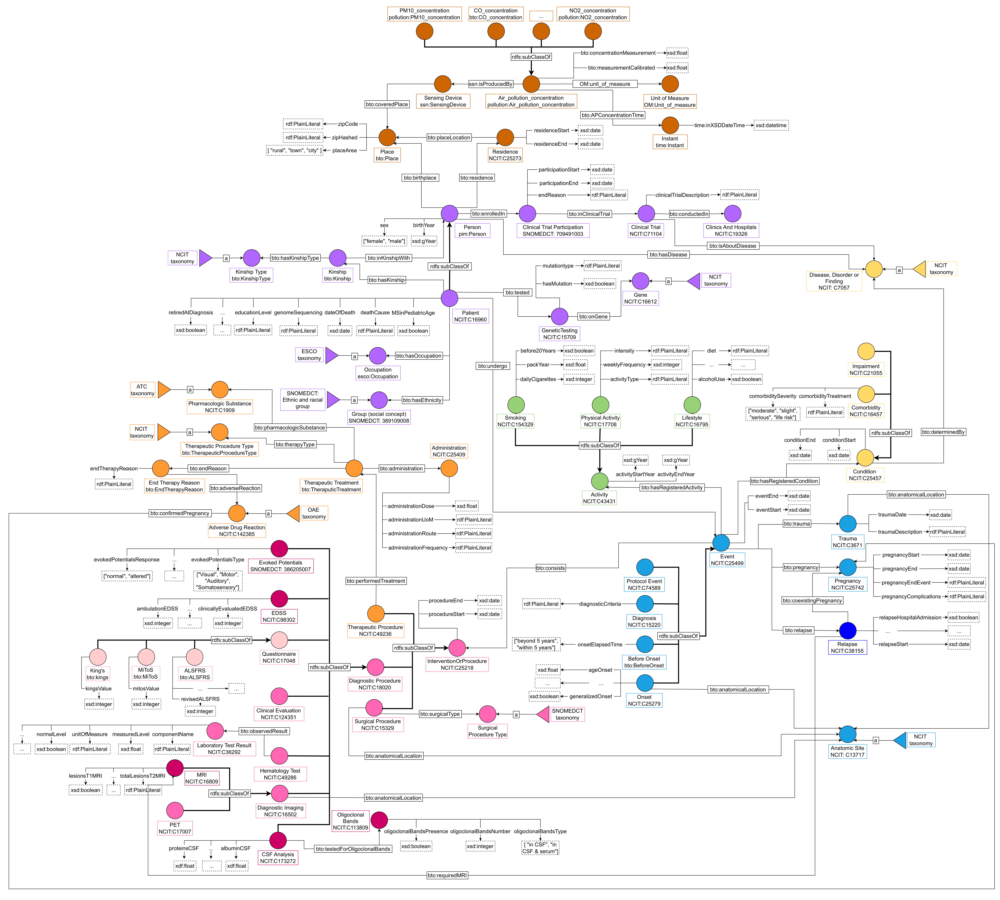
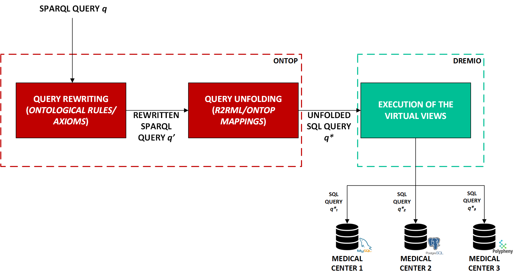
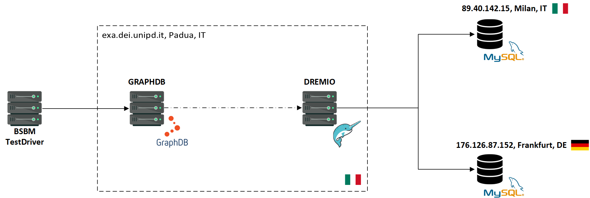

# Federated Data Analytics for Genomics Data

**Your Name**  
Master's Thesis in Computer Engineering  
University of Padova  
Academic Year 2023/2024

---

# The Challenge

Biomedical data is becoming increasingly complex. The rapid evolution of data storage systems has created a landscape where:

- Diverse data models exist (relational, hierarchical, graph-based).
- Integration of these models is crucial for genomics.

Understanding genetic diseases and advancing personalized treatments relies on integrating and analyzing this diverse data effectively.

---

# Proposed Solution

**Federated Data Analytics System**

A system designed to integrate and analyze clinical and genomics data seamlessly:

- **Objective:** Enable researchers to perform complex queries across multiple datasets without extensive preprocessing.
- **Key Components:** OBDA, data federation, semantic querying.

This approach reduces complexities in biomedical data management and accelerates research.

---

# Methodologies Overview

Resource Description Framework (RDF) provides the foundation for data interchange:

- **Triples Structure**: Subject, predicate, object.
- **Flexibility**: Supports integration of diverse data from various sources.
- **Ontology-Based Data Access (OBDA)**: Enhances semantic querying across federated databases.

---

# HEREDITARY Project

The HEREDITARY project is a European Union-funded initiative aimed at:

**Objective:**  
Transforming our understanding of brain diseases through integrated multimodal data analysis.

**Focus Areas:**

1. Integrating genomic and clinical data from various European centers.
2. Addressing the challenges of data heterogeneity.
3. Ensuring privacy compliance and data security.

**Result:** A unified system that supports advanced analytics and drives new insights in biomedical research.

---

# System Architecture

**Architecture Overview:**

The system architecture integrates multiple components:

1. **Ontop:** Semantic data integration layer.
2. **Dremio:** Data federation and virtualization layer.
3. **BRAINTEASER Ontology:** Provides the structure for querying.

This architecture supports real-time data retrieval and integration.

---

# Data Sources in the System

**MySQL:** Stores structured clinical data.  
**PostgreSQL:** Manages additional clinical datasets.  
**Polypheny:** Supports various data models, enhancing flexibility.  
**NAS Folders:** Hosts genomics data in VCF files.  
**Google Drive:** Integrates cloud-based storage for seamless data access.

Each data source is connected via Dremio's federation layer, enabling a unified view across diverse data repositories.

---

# Federation and Virtualization

### Federation Layer:

Integrates data across various sources, ensuring seamless access and querying.

### Virtualization Layer:

Creates virtual views without materializing data, optimizing performance and enabling complex queries across the federated system.

Dremio serves as the core engine for both layers, providing a robust platform for handling large-scale data integration tasks.

---

# Ontology Integration

The BRAINTEASER Ontology is central to the system:

**Features:**

- Models relationships between clinical and genomics data.
- Enhances query capabilities through semantic enrichment.
- Ensures interoperability and scalability.

This ontology allows for sophisticated data integration and querying, essential for advanced biomedical research.

---

# Use Case: ALSFRS Data Querying

To demonstrate the system's capabilities:

**Use Case:**  
Querying ALSFRS (Amyotrophic Lateral Sclerosis Functional Rating Scale) data across multiple sources.

- **SPARQL Query:** Retrieves comprehensive patient data.
- **Process:** Query rewriting, unfolding into SQL, and execution in Dremio.

This use case showcases the system's ability to integrate and analyze complex datasets effectively.

---

# Benchmarking the System

### Performance Evaluation:

**BSBM Benchmark:**  
Synthetic data evaluation shows robust query execution across diverse sources.

**SEASHELL Benchmark:**  
Real-world clinical data highlights system efficiency in handling complex queries.

These benchmarks validate the system's performance in real-world scenarios, emphasizing its potential for large-scale biomedical research.

---

# Conclusion and Future Work

The federated data analytics system developed in this thesis offers a powerful tool for integrating and analyzing heterogeneous biomedical data.

**Future Directions:**

1. **Scalability:** Enhance the system's ability to handle larger datasets.
2. **Privacy:** Strengthen data security and compliance with regulations.
3. **Optimization:** Improve performance through advanced query optimization techniques.

This system lays the groundwork for future advancements in biomedical data research, contributing to better healthcare outcomes.

---

# Thank You!

Questions?  
Feel free to ask!
